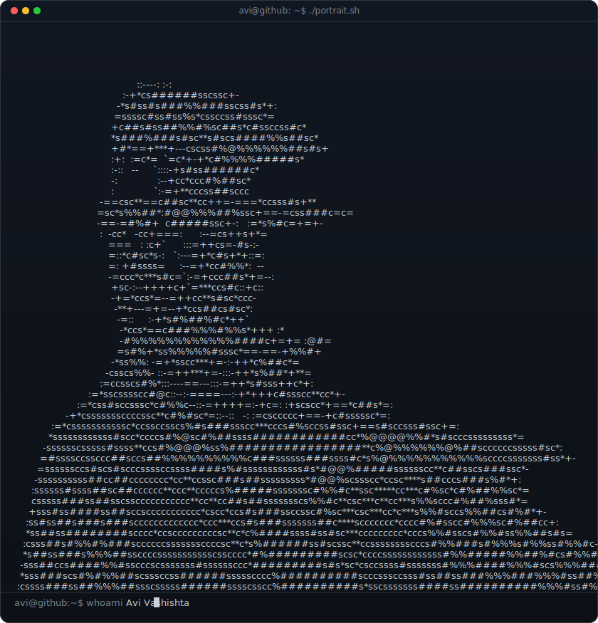

<!--
  This is your PROFILE README. It goes in a repo named exactly after your
  username (e.g. github.com/OCTOCAT/OCTOCAT) so GitHub shows it on your profile.
  Replace the ALL-CAPS placeholders. Widths 370/490 keep the portrait and info
  card the same height -- if you change the info card's H, re-match these.
-->

<table>
<tr>
<td valign="top"></td>
<td valign="top"></td>
</tr>
</table>

## Subhankar Roy

**Full Stack Developer · AI Builder · UI/UX Enthusiast**

 

### 🛠️ Featured Projects

| Project | Description | Language |
| :--- | :--- | :--- |
| 🎨 **[framerx](https://github.com/subhxroy/framerx)** | A modern Framer-inspired web experience focused on premium UI, smooth interactions, and responsive design. |  |
| 📡 **[sentira](https://github.com/subhxroy/sentira)** | A privacy-first surveillance system that utilizes Wi-Fi signals to detect presence without the use of cameras. |  |
| 📈 **[ai-trader](https://github.com/subhxroy/ai-trader)** | An AI-powered algorithmic trading bot designed to analyze market trends and execute trades. |  |
| 🛒 **[meatdae](https://github.com/subhxroy/meatdae)** | A full-featured online e-commerce platform with an integrated payment gateway and a dedicated admin panel. |  |
| 🎵 **[openify](https://github.com/subhxroy/openify)** | A free, retro-themed desktop music player designed for a seamless listening experience. |  |
| 🔒 **[anonymous](https://github.com/subhxroy/anonymous)** | A premium privacy-first ephemeral messaging application with secure digital vaults. |  |

 

<!-- animated contribution graph, refreshed daily by the workflow -->

