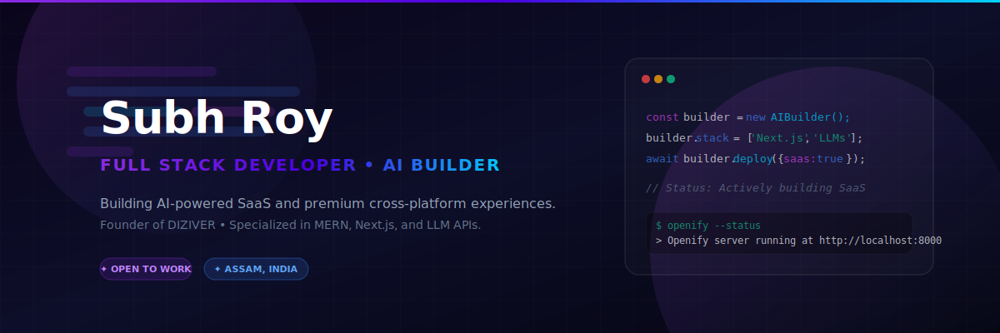

  <!-- Profile Banner -->
  

   

  <!-- Headline Typing Animation (Simulated using SVG) -->
  <h1>
    
  </h1>

  

    <strong>Building digital products with code, design & AI.</strong>
  

  

    <a href="https://subhxroy.framer.website/" target="_blank">🌐 Portfolio Website</a> &bull; 
    <a href="mailto:contact.subhroy@gmail.com">✉️ Contact Me</a> &bull; 
    <a href="https://x.com/subhxroy" target="_blank">🐦 Twitter / X</a> &bull; 
    <a href="https://www.instagram.com/subhroyx/" target="_blank">📸 Instagram</a> &bull;
    <a href="https://linkedin.com/in/subhxroy" target="_blank">💼 LinkedIn</a>
  

---

### ✦ About Me

I am a Full Stack Developer, UI/UX enthusiast, and AI product builder based in Assam, India. I specialize in designing and engineering premium web applications, building secure zero-knowledge cryptographic systems, and leveraging generative AI APIs to launch functional, high-performance applications.

- 🚀 Currently building: **Nexus AI** (a Perplexity-style search & research engine)
- 🧠 Focus areas: **React & Next.js ecosystem**, **client-side cryptography**, and **fluid micro-animations**
- ⚡ Design-first: I believe that code and design must work in tandem to create exceptional developer and user experiences.

---

### ✦ Tech Stack & Toolbox

  
**Core Technologies**
 

**Database & Cloud**
 

**Design & Styling**
 

---

### ✦ Featured Production Projects

Here are the projects that highlight my capabilities in AI integrations, advanced frontend design, and zero-knowledge security:

<table>
  <tr>
    <td width="50%" valign="top">
      <h3>🔍 Nexus AI</h3>
      
<em>Premium Perplexity-style Search & Deep Research SaaS</em>

      <ul>
        <li>SSE-streaming answers and multi-agent search pipeline.</li>
        <li>Indian-market localization (UPI, INR pricing tiers).</li>
        <li>Resend-inspired clean typography & custom variables design.</li>
      </ul>
      

        <strong>Next.js 16 • React 19 • Tailwind v4 • Prisma SQLite • Zustand</strong>
         
        <a href="https://github.com/subhxroy/ai-search-saas">💻 Repository</a>
      

    </td>
    <td width="50%" valign="top">
      <h3>🔒 Anonym</h3>
      
<em>Ephemeral Secure Messaging & Zero-Knowledge Stealth Chat</em>

      <ul>
        <li>Client-side AES-256 encryption via URL fragment parameters.</li>
        <li>Database self-immolation (destroying read payload on fetch).</li>
        <li>Focus loss concealment, screenshot blocking, right-click locking.</li>
      </ul>
      

        <strong>Vite • React • TypeScript • Tailwind • Firebase Firestore</strong>
         
        <a href="https://github.com/subhxroy/anonymous">💻 Repository</a> &bull; <a href="https://end-to-end-v2.netlify.app/">🌐 Live Demo</a>
      

    </td>
  </tr>
  <tr>
    <td width="50%" valign="top">
      <h3>🎵 Openify</h3>
      
<em>Desktop Music Player with Retro Turntable UI & Recommendations</em>

      <ul>
        <li>Turntable animations, rotating vinyl, and responsive needle arm.</li>
        <li>Canvas-based real-time album cover color extraction.</li>
        <li>App server offering continuous recommendation queues.</li>
      </ul>
      

        <strong>Electron • JavaScript • HTML5 Canvas • Python (Flask)</strong>
         
        <a href="https://github.com/subhxroy/openify">💻 Repository</a>
      

    </td>
    <td width="50%" valign="top">
      <h3>🛒 Sapling</h3>
      
<em>Premium Editorial Redesign & Secured E-Commerce Demo</em>

      <ul>
        <li>Earthy grocer layout utilizing outfit typography & custom grid.</li>
        <li>Built-in XOR body encryption & browser host locking.</li>
        <li>Python automation parsing dynamic inventory cache.</li>
      </ul>
      

        <strong>Vite • HTML5 • Vanilla CSS • JavaScript • Python Scraper</strong>
         
        <a href="https://github.com/subhxroy/sapling">💻 Repository</a>
      

    </td>
  </tr>
</table>

---

### ✦ GitHub Performance & Activity

  <table border="0">
    <tr>
      <td>
        
      </td>
      <td>
        
      </td>
    </tr>
  </table>
  
   
  
  

